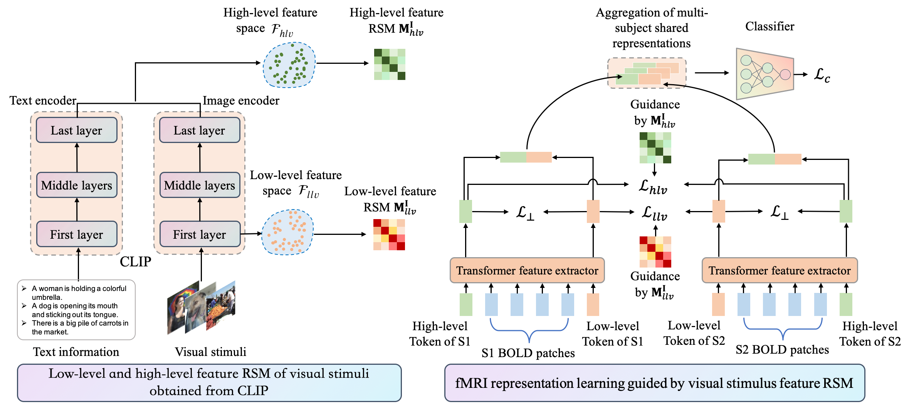

# CLIP-MUSED: CLIP-Guided Multi-Subject Visual Neural Information Semantic Decoding

The official implementation of the multi-subject visual neural information semantic decoding method described in **CLIP-MUSED: CLIP-Guided Multi-Subject Visual Neural Information Semantic Decoding**.



## 1. Installation
Create and activate the environment:
```shell
conda create -n clipmused python==3.7
conda activate clipmused
```
Install dependencies:
```shell
pip install -r requirements.txt
```

## 2. Usage
**Model training**
```shell
CUDA_VISIBLE_DEVICES=0 python3 -W ignore decoding_HCP_MS.py -m='train' -e=500 -edim=512 -depth=18 -usecls -hfmodel='aver_cap_concat_vitb16_clip' -lfmodel='img_vitb16_clip' -hdim_rd='not_rd' -ldim_rd='not_rd' -hlayer='-1' -llayer='0' -otype='F' -coe_clf=1 -coe_orth=1e-3 -coe_rdm_hlv=1e-3 -coe_rdm_llv=1e-1 -fea_pp -thres=1.5 -sel_label -abkind='label_0p1'
```

**Evaluation**
```shell
for sub in '233326' '172130' '951457' '191336' '169040' '878776' '169343' '102816' '573249'
do
CUDA_VISIBLE_DEVICES=0 python3 -W ignore decoding_HCP_MS.py -m='test' -edim=512 -depth=18 -usecls -sel_label --subject=$sub -me=-1 -abkind='label_0p1'
done
```